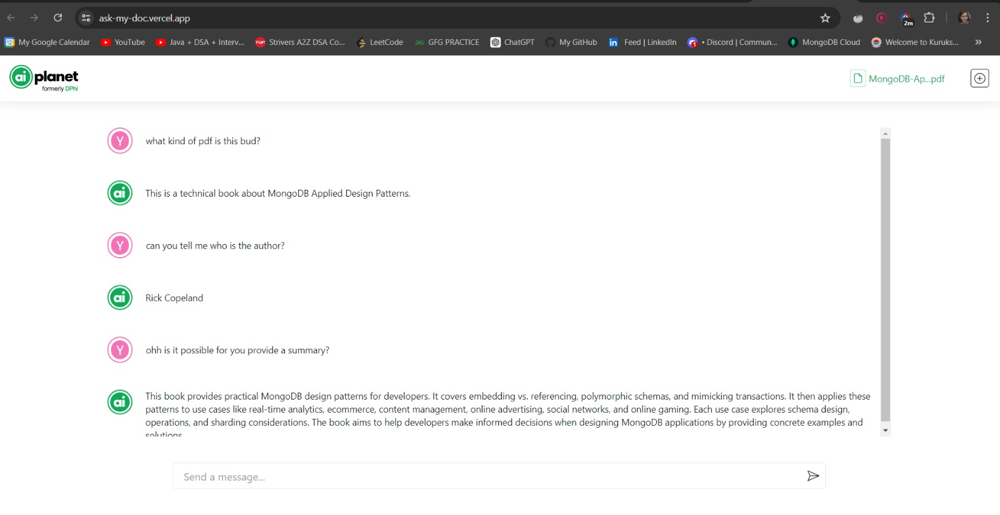

# AskMyDoc

AskMyDoc is an AI-powered application that allows users to upload PDF documents and ask questions based on the content of those documents. It uses a combination of frontend technologies (React, Axios and TailwindCSS) and backend technologies (Node.js, Express.js, Langchain, Google Vertex AI, pdfreader, and multer) to provide this functionality.



[See Preview](https://vimeo.com/971623115)

[Visit Live App](https://ask-my-doc.vercel.app/) or (https://ask-my-doc.vercel.app/)

**Note:** Sending frequent questions might exceed requests quota please take care of that.

## Technologies Used

- **Frontend**: React, TailwindCSS, Axios
- **Backend**: node.js, express.js, @langchain, @langchain/google-vertexai, pdfreader, multer

## Local Setup Guide

Follow the steps below to set up the project on your local machine.

### 1. Clone the Repository

First, clone the repository to your local machine:

```bash
git clone <repo-url>
```

### 2. Install Frontend Dependencies
Navigate to the `client/ui` directory from root and install the frontend dependencies:

```bash
cd client/ui
npm install
```

### 3. Install Backend Dependencies
Move to the `server` directory from and install the backend dependencies:

If you are in  `ui` directory right now:
```
cd ../../server
npm install
```
If you are at root:
```
cd server
npm install
```

### 4. Set Up Environment Variables
#### Frontend

In the `client/ui` directory, create a `.env` file and add the following environment variable:

```
VITE_BACKEND_API = "your-backend-api-link"
```

#### Backend
In the server directory, create a JSON file containing your Google project credentials. Name it `credentials.json` or any name of your choice.

Create a `.env` file in the server directory and add the following environment variable, specifying the path to your Google project credentials:

```
GOOGLE_APPLICATION_CREDENTIALS = "path-to-your-google-project-credentials.json-file"
```

In my example:
```
GOOGLE_APPLICATION_CREDENTIALS= "./credentials.json"
```

### 5. Running the Application
#### Frontend

To run the frontend application, navigate to the `client/ui` directory and execute:

```bash
npm run dev
```
This will start the frontend application at http://localhost:5173/.

#### Backend
To run the backend server, navigate to the `server` directory and execute:

```bash
npm run dev
```
The server will run by default at http://localhost:4000/. If you want to use a different port, set the `PORT` environment variable in your `.env` file or change the hardcoded port value in the `index.js` file.

### 6. Creating the Uploads Directory
You might need to create an `uploads` directory in the `server` directory to store uploaded files. Create it manually if it's not created automatically on starting server, you can also run the following command in `server` directory:

```bash
mkdir uploads
```
This should allow you to run your application locally.

## API Documentation
### Endpoints
There are only two end-points in our application for now:

`POST` : `/upload`

Description: Uploads a PDF file to the server.
#### Request:
- Form Data is to be sent with a key `pdf` with pdf file as its value
- Headers to send form data
```
headers: {
    'Content-Type': 'multipart/form-data',
},
```

#### Response:
- JSON
- filename (string): The name with which the file is stored on the server. This is the same value that has to be sent in `/ask` request.
```
{
    filename: "Name of the file stored at server."
}

```


`POST` : `/ask`

Description: Asks a question based on the content of an uploaded PDF.
#### Request:
- JSON
- question (string): The question to ask.
- filename (string): The name of the file on the server to take context from. Will be received in response from `/upload` request.
```
{
    question: "User's question.",
    filename: "Name of the file to pick context from."
}
```
#### Response:
- JSON
- answer (string): The AI-generated answer.
```
{"answer": "Your AI generated answer"}
```


## Conclusion
That's all for setting up and running AskMyDoc! Check out the application and enjoy asking questions from your PDF documents. If you encounter any issues, feel free to open an issue on the repository.